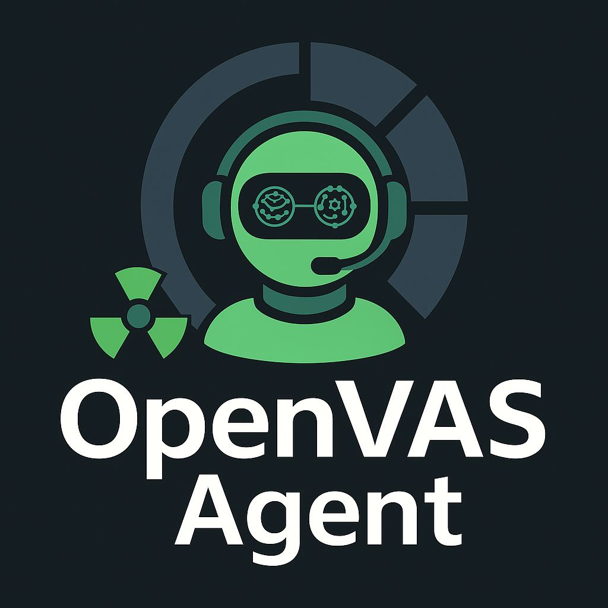

# OpenVAS Agent: Your AI-Powered Vulnerability Analysis Copilot



Welcome to the OpenVAS Agent project! This tool leverages the power of AI to revolutionize how you interact with the OpenVAS vulnerability scanner. Our goal is to create a powerful, intuitive copilot that assists you in analyzing vulnerabilities, interpreting results, and streamlining your security workflow.

## 🚀 Features

*   **AI-Powered Vulnerability Analysis:** Go beyond simple scans. The agent helps you understand the real-world impact of vulnerabilities.
*   **Intelligent Prioritization:** Automatically prioritize alerts based on severity, exploitability, and asset criticality.
*   **Actionable Remediation:** Receive best-practice remediation suggestions tailored to your specific environment.
*   **User-Friendly Interface:** Interact with OpenVAS through a simple, conversational interface.
*   **Customizable Workflows:** Adapt the agent to your unique security needs and scenarios.

## 🔧 Getting Started

### Pre-requisites

*   An operational OpenVAS/Greenbone Vulnerability Management (GVM) instance.
*   Python 3.8 or higher.
*   Access to the GVM API.

### Installation

1.  **Clone the repository:**
    ```bash
    git clone https://github.com/raphaelalvesdev/CEIA_OpenVAS_Agent
    cd CEIA_OpenVAS_Agent
    ```

2.  **Create and activate a virtual environment:**
    ```bash
    python3 -m venv .venv
    source .venv/bin/activate
    ```

3.  **Install the required dependencies:**
    ```bash
    pip install -r requirements.txt
    ```

4.  **Configure your environment:**
    Create a `.env` file in the root directory of the project and add the following the informations of `ENV.md`

### Permissions

To allow the agent to connect to the `gvmd.sock` for API requests, you may need to adjust its permissions:

```bash
sudo chmod 660 /run/gvmd/gvmd.sock
```

If you still encounter issues, you can try a more permissive setting (use with caution):

```bash
sudo chmod 777 /run/gvmd/gvmd.sock
```

### Running the Agent

Launch the OpenVAS Agent with the following command:

```bash
python3 main.py
```

## 🤝 Contributing

We welcome contributions from the community! If you'd like to get involved, please check out our [Contributing Guide](CONTRIBUTING.md) for more information on how to:

*   Report bugs and request features
*   Submit pull requests
*   Improve documentation

## 📜 License

This project is licensed under the MIT License. See the [LICENSE](LICENSE) file for details.

## 📧 Contact

Have questions or feedback? Feel free to reach out to us at [your-email@example.com](mailto:your-email@example.com).